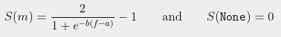
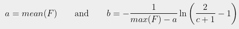

# REINVENT benchmarking

Code is adapted from [MarcusOlivecrona/REINVENT](https://github.com/MarcusOlivecrona/REINVENT).

Updated for use with PyTorch v1.10.0. Made for use on CC cluster.


## Environment

All required imports and modules are found in `make_env.sh`. Create virtual environment using 
```
./make_env.sh
source ~/env/reinvent/bin/activate
```

## Prepare data

Put data into the `data/` directory. Convert the smiles of data into `data/data.smi` by running
```
python prepare_data.py
```
You may need to modify the script depending on the format of dataset.

Then run 
```
python data_structs.py
```
to create the `mols_filtered.smi` and `Voc` file required in the `data/` directory. Note that original filtering from REINVENT 1.0 is removed, and SMILES are just check for validitiy and canonicalised.

## Train model

Pretrain the model for specified `num-epochs` by running:
```
python train_prior.py --num-epochs 100
```

You can view progress bar by toggling flag `--verbose`. 

Early stopping is implemented, default split is 80/20 using the first 80% of SMILES as training. Learning rate is decreased every 50 steps. The model is saved in `data/Prior.ckpt`.

## Fitness function

The fitness function is a class in `custom.py`. Modify the fitness function by changing the `fitness_function` function, which takes in a SMILES and outputs a float value. Return `None` for invalid smiles.

The values will be automatically scaled by a sigmoid. For sampled molecules *m* with fitness *f*, the score is (invalid molecules have 0 reward and do not affect the agent)



where *a* is the average of all known fitnesses from previous generations, and *b* is the slope of the sigmoid, calculated from a threshold. 

For a set *F* of fitnesses from previous generations



where *c* is the specified threshold (default 0.8). This means for the current fitnesses *F*, the maximum fitness will map to 0.8 on the sigmoid. The smaller the threshold *c*, the stronger the reward for fitnesses larger than *F*.

All other parameters are left as default from REINVENT 1.0.

## Run REINVENT

Run the REINVENT for generations = `num-steps` with evaluations = `batch_size` per generation. Run the script
```
python main.py --num-steps 10 --batch-size 500
```

Results will be saved in `data/results`, in a folder named by the timestamp of run. In this folder, a trace of the optimisation is plotted, and the results for each generation (`results.csv`), and the best molecule per generation (`best_results.csv`) are saved.

